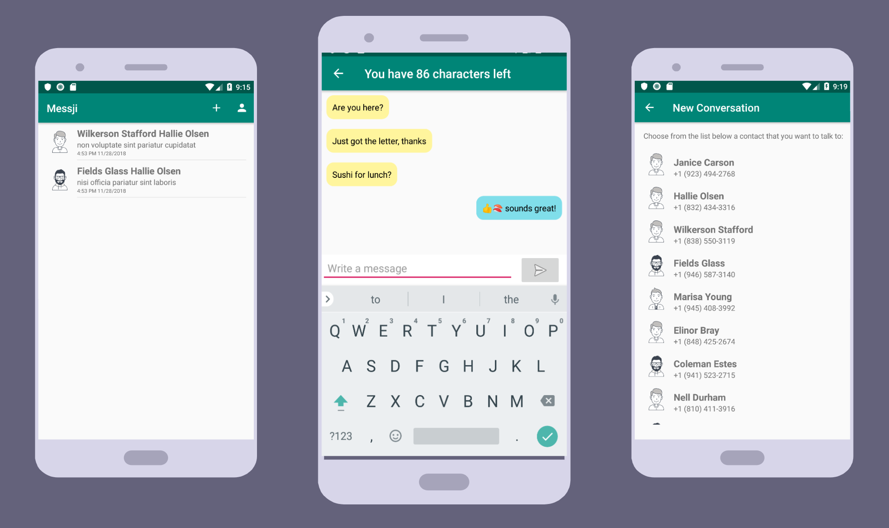
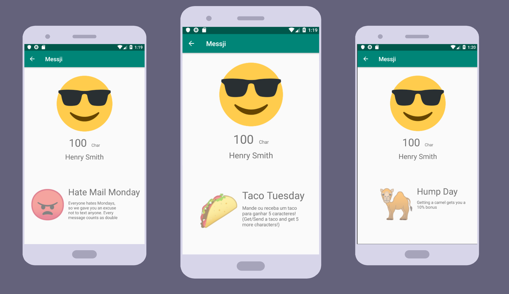
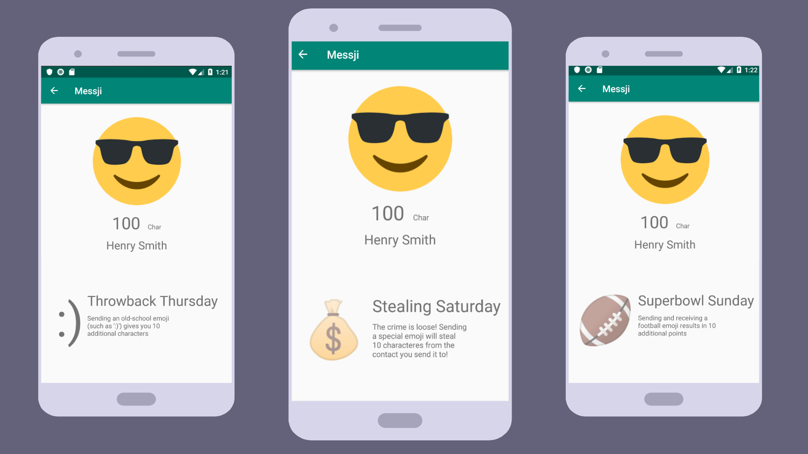

# Messji
Our messenger app that counts and limits your char (but not emojis 😉)

## The Team

The Messji Team consisted of Peter Flickinger, Henrique, and Thomas. Together we worked with our mentor Justin (Android UX Engineer at Google) to create a messenger application. The team focused on learning Java and Android's environment while writing this app. This projected provided a fun way to get introduced into the Android development world. Each student participated equally in coding the project and committed significant changes to GitHub. 

## The Project

The bulk of the project was spent on getting the backbones for a messenger app built. However, to spice up the app, depending on the day different emojis have different impacts on your daily limit of characters that you can send. For example, if you get a camel on Wednesday, you get a special bonus. 

LINKS:  
[Trello Board 🐺](https://trello.com/b/ToJsQBHP/messji)  
[Google Folder 📄](https://drive.google.com/drive/u/0/folders/16Vr0-vgUZIk3y8BdzbQbM3RVXWoTErUo)  

